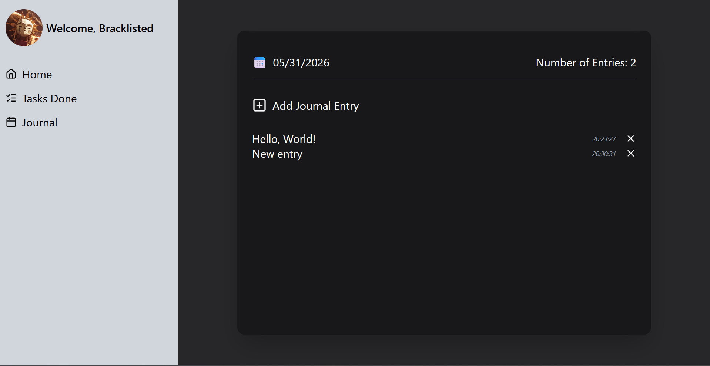
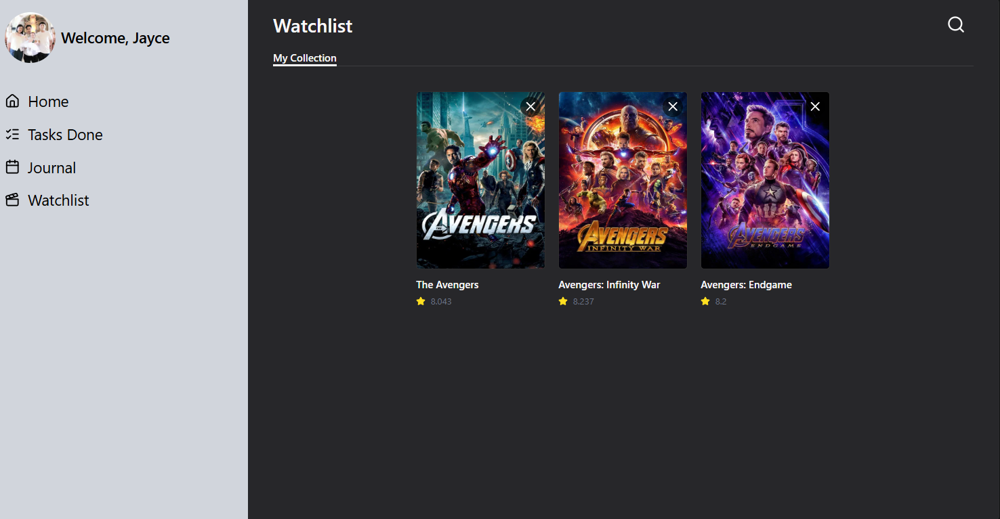
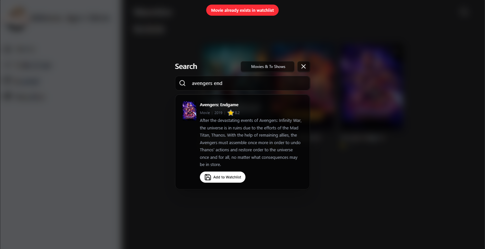

# 🖋️ To-Do List 📄
A Simple To-Do List website that fully utilizes the PERN(Postgresql, express, react, and node.js) stack. Authentication is handled by Clerk and the database is connected to Neon's Database
## 🌐 Link to the website
[Click me for Website Link](https://fullstack-to-do-list-ebon.vercel.app/)
## ℹ️ Information
Give the website a few seconds up to 3 minutes in order to load. This is due to a coldstart because of Render!
### 📷 Tasks Page

### 📷 Completed Tasks Page

### 📷 Journal page

### 📷 Watchlist page

### 📷 Watchlist Search 
